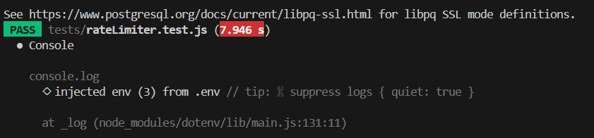
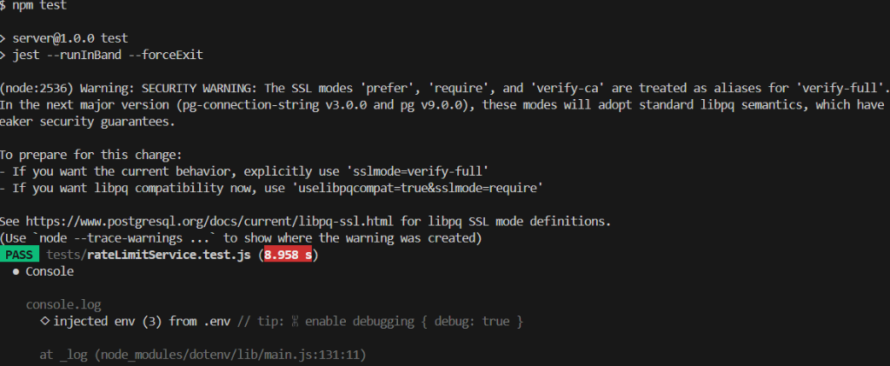
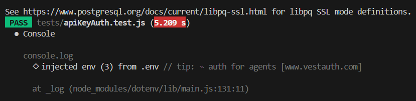
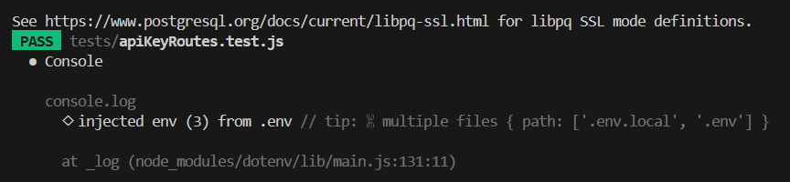

# Test Automation & Red Run Evidence Report

> **Project:** RateGuard API Rate Limiter  
> **Evaluation Reference:** Stage 2 — Test Automation & Deliberate Red Run  
> **Author:** Abinanthan S &bull; [GitHub Repository](https://github.com/AbinanthanS/Tactive_Assessment)

---

## 1. Test Strategy & Specifications

The test suite validates the full lifecycle across happy paths, boundary edge cases, and failure modes using **Jest** and **Supertest** against a live PostgreSQL database.

| Parameter | Specification |
|---|---|
| **Frameworks** | Jest v30.4.2 &bull; Supertest v7.2.2 |
| **Execution Mode** | `npm test` (`jest --runInBand --forceExit`) |
| **Database Isolation** | Live Neon PostgreSQL transactions with automated teardown (`tests/teardown.js`) |
| **Total Coverage** | 7 Test Suites &bull; 22 Automated Integration Tests |

---

## 2. Test Suite Matrix

| Test Suite | Tests | Category | Scope & Assertions |
|---|---|---|---|
| [`health.test.js`](../server/tests/health.test.js) | 1 | Smoke | Verifies `GET /health` returns `200` with `{"status":"ok","service":"rateguard"}` |
| [`authMiddleware.test.js`](../server/tests/authMiddleware.test.js) | 3 | Security | Blocks missing `Authorization`, malformed Bearer tokens, and forged JWTs with `401` |
| [`auth.test.js`](../server/tests/auth.test.js) | 4 | Auth & Validation | User registration (`201`), duplicate email prevention (`409`), valid login (`200`), invalid credentials (`401`) |
| [`apiKeyRoutes.test.js`](../server/tests/apiKeyRoutes.test.js) | 4 | Key Management | Key creation with `rg_live_...` secret (`201`), listing user keys (`200`), key revocation (`200`), unauthenticated access rejection (`401`) |
| [`apiKeyAuth.test.js`](../server/tests/apiKeyAuth.test.js) | 3 | Gateway Auth | Pass-through for valid `X-API-Key`, rejection for missing keys (`401`), rejection for revoked keys (`401`) |
| [`rateLimitService.test.js`](../server/tests/rateLimitService.test.js) | 4 | Concurrency & SQL | Atomic window counter creation, consecutive increments, quota checks, and tenant key isolation |
| [`rateLimiter.test.js`](../server/tests/rateLimiter.test.js) | 3 | RFC Compliance | Injects RFC 6585 headers (`X-RateLimit-*`), triggers `429 Too Many Requests` on over-limit, computes accurate `Retry-After` |

---

## 3. Green Run Verification (22/22 Passing)

```bash
cd server
npm test
```

### Execution Output
```
PASS tests/rateLimiter.test.js
PASS tests/rateLimitService.test.js
PASS tests/apiKeyAuth.test.js
PASS tests/auth.test.js
PASS tests/apiKeyRoutes.test.js
PASS tests/authMiddleware.test.js
PASS tests/health.test.js

Test Suites: 7 passed, 7 total
Tests:       22 passed, 22 total
Snapshots:   0 total
Time:        33.801 s
```

### Green Run Visual Evidence

| Full Test Suite Passing | Individual Suite Logs |
|---|---|
|  |  |

| Rate Limiter Tests | Rate Limit Service (PostgreSQL Atomic) |
|---|---|
|  |  |

| API Key Auth Middleware | API Key Management Routes |
|---|---|
|  |  |

---

## 4. Deliberate Red Run (Failure Demonstration)

To verify the test suite actively detects broken code and avoids false positives, a deliberate assertion mismatch was injected into [`server/tests/health.test.js`](../server/tests/health.test.js).

### Injected Fault
```diff
 describe("Health endpoint", () => {
     test("GET /health should return 200", async () => {
         const response = await request(app)
             .get("/health");

-        expect(response.statusCode).toBe(200);
+        expect(response.statusCode).toBe(404); // DELIBERATE RED RUN: Expecting 404 instead of 200

         expect(response.body).toEqual({
             status: "ok",
             service: "rateguard"
         });
     });
 });
```


### Red Run Failure Output
```
FAIL tests/health.test.js
  ● Health endpoint › GET /health should return 200

    expect(received).toBe(expected) // Object.is equality

    Expected: 404
    Received: 200

       7 |         .get("/health");
       8 |
    >  9 |         expect(response.statusCode).toBe(404);
         |                                     ^

Test Suites: 1 failed, 6 passed, 7 total
Tests:       1 failed, 21 passed, 22 total
```


---

## 5. Recovery & Re-Green Verification

1. Restored `health.test.js` to expected status code `200`.
2. Re-ran `npm test`.
3. Verified all **7 test suites and 22 test cases** returned to 100% green pass.
